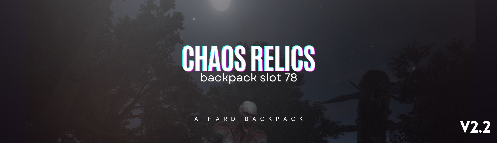

  

  <h1 align="center">Chaos Relics - Backpack Slot(78) - v2.2</h3>

  

    (Server side only / server friendly)
     
    Nexusmods: https://www.nexusmods.com/7daystodie/mods/5558
     
  

## 📋 Mod Description

This mod increases the player backpack capacity to **78 slots** in 7 Days to Die. It enhances the gameplay experience by allowing players to carry more items.

### ✨ Features

- **78 Backpack Slots**: Increases default backpack capacity to 78 slots
- **Optimized UI**: Backpack interface optimized with 13 columns x 6 rows layout
- **Server Friendly**: Only requires server-side installation
- **Lightweight Mod**: Doesn't affect performance
- **Easy Installation**: Plug & Play

### 🎯 v2.2 Updates

- UI layout optimizations
- Backpack interface width increased (873px)
- Currency and icon positions repositioned
- Background graphics updated for new dimensions
- Grid system improved (6 rows x 13 columns)
- Carry capacity set to 34

### 📦 Installation

1. Place the mod in your server's `Mods` folder
2. Restart the server
3. Ready to go!

### 🔧 Technical Details

- **Backpack Size**: 78 slots
- **Carry Capacity**: 34
- **Grid Layout**: 13 columns x 6 rows
- **UI Width**: 873px
- **UI Height**: 416px
